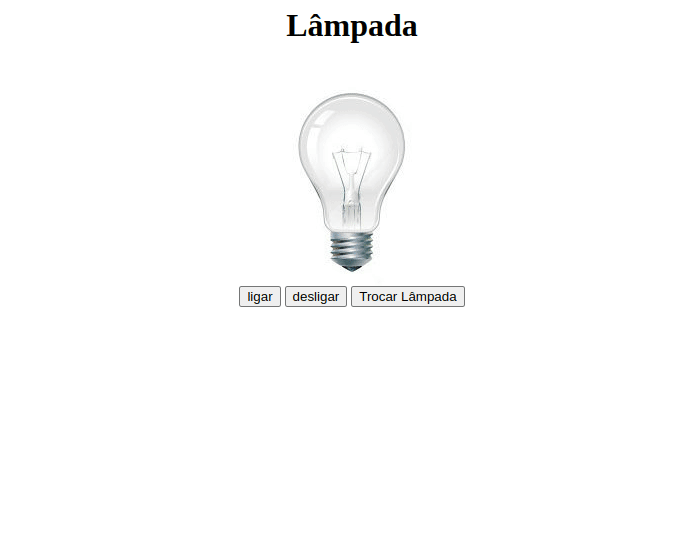

<<<<<<< HEAD
# <p align="center">Project Lighting</p>
<h1 align="center"> 💡 </h1>


**Projeto Lâmpada Interativa** Este projeto é uma simulação interativa de uma lâmpada, criada utilizando HTML, CSS e JavaScript. A página apresenta uma lâmpada que pode ser ligada, asentida e até mesmo quebrada interativamente.

<p align="center">
  
</p>

## 🧑‍💻 Tecnologias
- [JavaScript](https://developer.mozilla.org/en-US/docs/Web/JavaScript)
- [HTML](https://developer.mozilla.org/en-US/docs/Web/HTML)
- [CSS](https://developer.mozilla.org/en-US/docs/Web/CSS)

## ♻️ Clonar o Projeto

```bash 
# clonar o Projeto
$ git clone git@github.com:Davijluna/Casa-de-Cambio.git
```
```bash 
# Entrar no diretório
$ cd projectLumiere
```
```bash 
# instalando dependêcia
$ npm install
```
